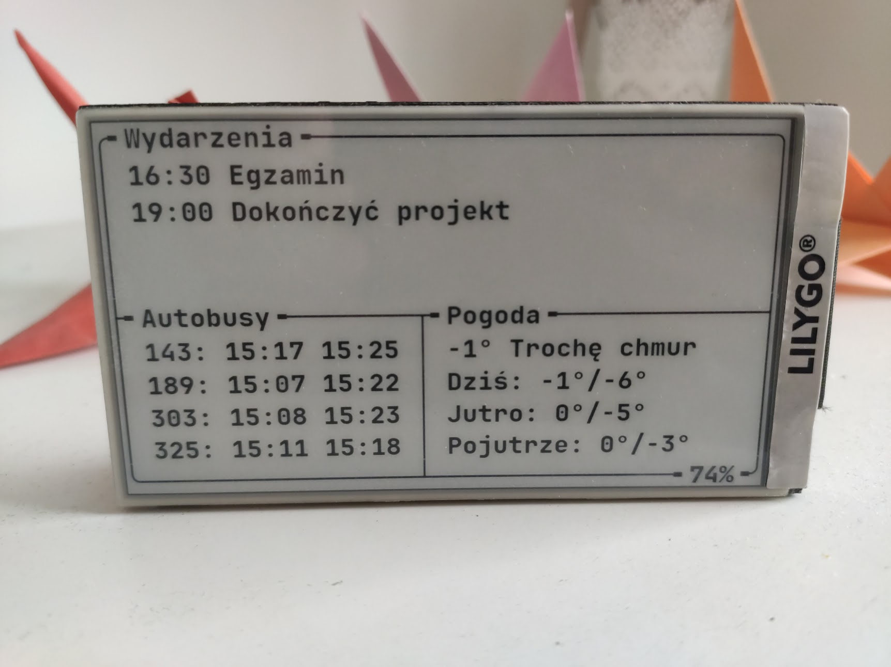

### eink-dashboard-server

This is the server part of a hobby project to display a simple dashboard on an E-Ink display.

Currently implemented features are:

- upcoming events from Google Calendar
- next departures for nearby bus/tram/metro etc. stops
- current and forecasted weather using [Open-Meteo](https://open-meteo.com/) API

This program is intended to run on a server. It gathers data from all the sources and renders it into a text
representation. This message can then be downloaded from the actual display using the `/lilygo` endpoint. This was done
to minimize amount of low-level C++ code, as well as to conserve battery by limiting network requests.

`ETag` and `If-None-Match` headers are used to avoid resending data when it hasn't changed.

Optionally the display can send its battery level via a query param. It will be stored in a log file on the server -
this can be used to track battery usage over time.
